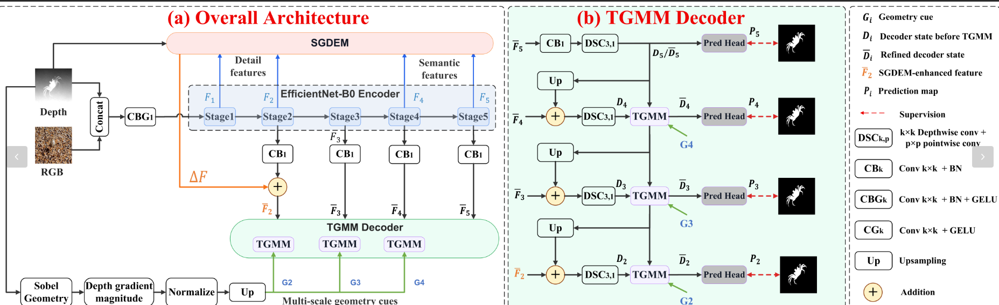
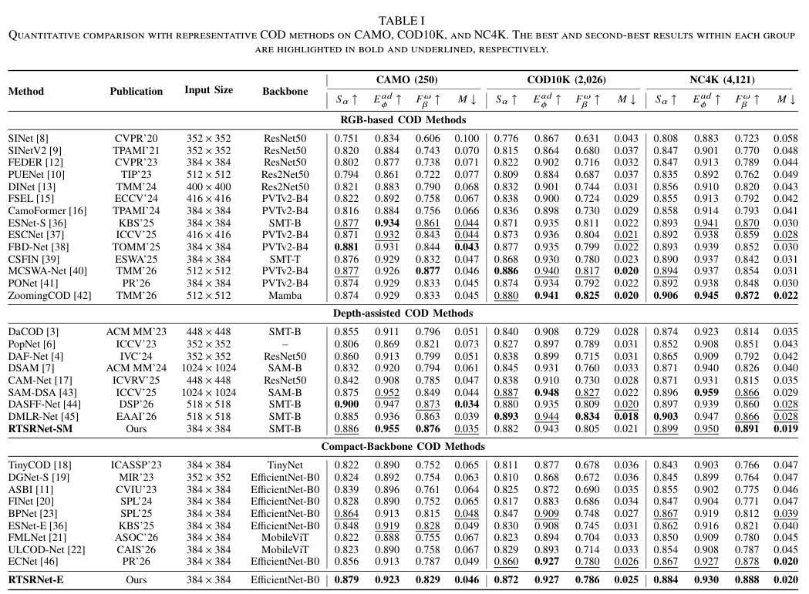
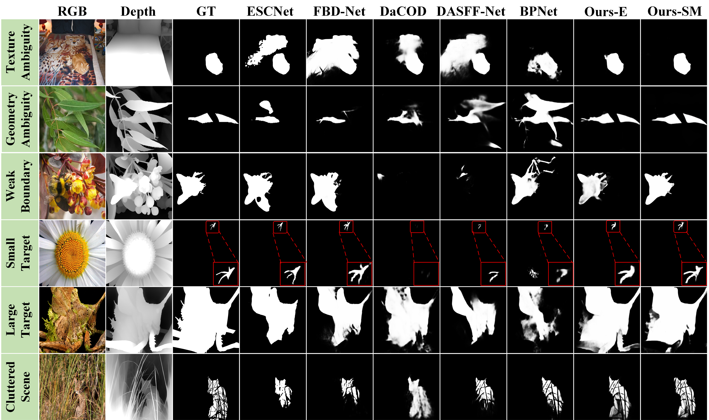
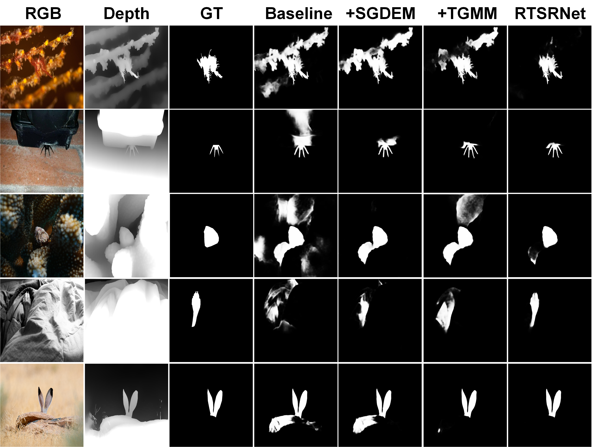

# RTSRNet

## Residual Target-Sensitive Refinement Network for Depth-Assisted Camouflaged Object Detection

**Tan Song, Jinbao Li**

> Manuscript submitted to **IEEE Transactions on Multimedia (TMM)**.

RTSRNet is a depth-assisted camouflaged object detection framework that formulates refinement-stage cue utilization as **target-sensitive cue refinement**. Instead of directly treating shallow detail and depth-derived geometry as uniformly reliable content, RTSRNet uses target-related context to regulate how ambiguous cues update task representations.

The framework contains two main modules:

- **SGDEM — Semantic-Geometric Detail Enhancement Module:** establishes a semantic-guided reference for ambiguous shallow responses and combines semantic discrepancy with depth-derived geometry to refine shallow representations.
- **TGMM — Target-guided Geometry Modulation Module:** transforms raw depth-derived geometry into target-aware geometry and uses it to progressively refine decoder representations.

---

## News

- **2026:** RTSRNet manuscript submitted to **IEEE Transactions on Multimedia (TMM)**.
- Code, trained weights, prepared RGB/depth data, prediction maps, and evaluation scripts are provided for reproducibility.

---

## Overview of RTSRNet

<p align="center">
  
</p>

<p align="center">
  <b>Overview of RTSRNet.</b> RGB and depth inputs are encoded with SGDEM for shallow refinement and TGMM for multi-scale decoder refinement.
</p>

Given an RGB image and its estimated depth map, RTSRNet first performs RGB-D projection and hierarchical feature extraction. SGDEM refines the shallow encoder representation using detail, semantic, and depth-derived geometric information. The decoder then applies TGMM at multiple stages to convert raw geometry into target-aware guidance and progressively refine the decoder states.

---

## Quantitative Comparison

Quantitative comparison with state-of-the-art camouflaged object detection methods on the benchmark datasets. The best results are highlighted in bold.

<p align="center">
  
</p>

<p align="center">
  <b>Table I.</b> Quantitative comparison with state-of-the-art methods.
</p>
---

## Qualitative Comparison

<p align="center">
  
</p>

<p align="center">
  <b>Fig. 7.</b> Qualitative comparison with representative COD methods under challenging camouflage conditions. Red boxes show enlarged regions for small-target comparison.
</p>

RTSRNet produces cleaner and more coherent predictions under texture ambiguity, geometry ambiguity, weak boundaries, small targets, large targets, and cluttered backgrounds.

---

## Ablation Visualization

<p align="center">
  
</p>

<p align="center">
  <b>Fig. 8.</b> Qualitative ablation of SGDEM and TGMM under the same EfficientNet-B0 backbone. The single-module variants are compared with the baseline and the full RTSRNet-E.
</p>

The visual comparison shows the complementary effects of SGDEM and TGMM: SGDEM suppresses distracting shallow responses and preserves local structures, while TGMM improves target coherence through target-guided geometry refinement.

---

## Downloads

### Trained Model

| Model | Backbone | Input Size | Download |
|---|---|---:|---|
| RTSRNet-E | EfficientNet-B0 | 384×384 | [Google Drive](YOUR_RTSRNET_E_PTH_GOOGLE_DRIVE_URL) / [Baidu Netdisk](YOUR_RTSRNET_E_PTH_BAIDU_URL) |

### Training and Testing Data

RTSRNet is trained with **2,026 COD10K training images + 1,000 CAMO training images** and evaluated on **CAMO (250)**, **COD10K (2,026)**, and **NC4K (4,121)**.

For exact reproduction, release the RGB images, masks, edge maps, and the **Depth Anything V2 depth maps used by RTSRNet** in prepared packages:

| Resource | Content | Download |
|---|---|---|
| RTSRNet Training Set | CAMO-train + COD10K-train; RGB / GT / Depth / Edge | [Google Drive](YOUR_TRAIN_RGB_DEPTH_GOOGLE_DRIVE_URL) / [Baidu Netdisk](YOUR_TRAIN_RGB_DEPTH_BAIDU_URL) |
| RTSRNet Testing Sets | CAMO-test + COD10K-test + NC4K; RGB / GT / Depth / Edge | [Google Drive](YOUR_TEST_RGB_DEPTH_GOOGLE_DRIVE_URL) / [Baidu Netdisk](YOUR_TEST_RGB_DEPTH_BAIDU_URL) |

Original RGB/GT datasets:

- **CAMO:** https://drive.google.com/open?id=1h-OqZdwkuPhBvGcVAwmh0f1NGqlH_4B6
- **COD10K:** https://drive.google.com/file/d/1vRYAie0JcNStcSwagmCq55eirGyMYGm5/view?usp=sharing
- **NC4K:** https://drive.google.com/file/d/1kzpX_U3gbgO9MuwZIWTuRVpiB7V6yrAQ/view?usp=sharing

The default depth maps in the manuscript are generated offline with **Depth Anything V2**:

- https://github.com/DepthAnything/Depth-Anything-V2

### Prediction Maps / Test Results

| Results | Download |
|---|---|
| RTSRNet-E prediction maps on CAMO / COD10K / NC4K | [Google Drive](YOUR_RTSRNET_PREDICTIONS_GOOGLE_DRIVE_URL) / [Baidu Netdisk](YOUR_RTSRNET_PREDICTIONS_BAIDU_URL) |

---

## Environment

```bash
conda create -n rtsrnet python=3.10 -y
conda activate rtsrnet
pip install -r requirements.txt
```

---

## Repository Structure

```text
RTSRNet/
├── Model/
│   ├── RTSRNet.py
│   ├── EfficientNet.py
│   └── modules.py
├── utils/
│   ├── config.py
│   ├── edge_dataloader.py
│   ├── metrics.py
│   └── utils.py
├── train.py
├── inference.py
├── evaluate.py
├── profile_model.py
├── analyze_internal_responses.py
├── requirements.txt
└── README.md
```

### Paper-to-Code Mapping

| Manuscript | Code |
|---|---|
| RTSRNet | `Model.RTSRNet.RTSRNet` |
| RGB-D projection | `RGBDProjection` |
| SGDEM | `SGDEM` |
| SGDB | `SGDB` |
| DCUB | `DCUB` |
| Depth-derived geometry | `DepthGeometryExtractor` |
| TGMM | `TGMM` |
| GCDUB | `GCDUB` |
| Prediction maps P2/P3/P4/P5 | `pred_head2` / `pred_head3` / `pred_head4` / `pred_head5` |
| Edge prediction | `edge_head` |

---

## Dataset Organization

```text
DATA_ROOT/
├── TrainDataset/
│   ├── Imgs/
│   ├── GT/
│   ├── Depth/
│   └── Edge/
└── TestDataset/
    ├── CAMO/
    │   ├── Imgs/
    │   ├── GT/
    │   ├── Depth/
    │   └── Edge/
    ├── COD10K/
    │   ├── Imgs/
    │   ├── GT/
    │   ├── Depth/
    │   └── Edge/
    └── NC4K/
        ├── Imgs/
        ├── GT/
        ├── Depth/
        └── Edge/
```

---

## Model

```python
from Model.RTSRNet import RTSRNet

model = RTSRNet(
    pretrained=True,
    ablation_mode="full",
)
```

### Load Trained Weights

```python
import torch
from Model.RTSRNet import RTSRNet, extract_state_dict

model = RTSRNet(pretrained=False, ablation_mode="full")
checkpoint = torch.load("RTSRNet-E.pth", map_location="cpu")
state_dict = extract_state_dict(checkpoint, use_ema=True)
model.load_state_dict(state_dict, strict=True)
model.eval()
```

---

## Training

```bash
python train.py \
  --dataset_dir /path/to/DATA_ROOT \
  --ablation_mode full \
  --epochs 180 \
  --batch_size 16 \
  --trainsize 384 \
  --amp
```

Main settings:

| Setting | Value |
|---|---|
| Optimizer | AdamW |
| Epochs | 180 |
| Batch size | 16 |
| Input size | 384×384 |
| Initial learning rate | 3×10^-4 |
| Minimum learning rate | 1×10^-6 |
| Weight decay | 1×10^-4 |
| Backbone LR multiplier | 0.2 |
| EMA decay | 0.999 |

---

## Inference

```bash
python inference.py \
  --ckpt /path/to/RTSRNet-E.pth \
  --dataset_dir /path/to/DATA_ROOT \
  --datasets CAMO COD10K NC4K \
  --ablation_mode full
```

---

## Evaluation

```bash
python evaluate.py \
  --ckpt /path/to/RTSRNet-E.pth \
  --dataset_dir /path/to/DATA_ROOT \
  --datasets CAMO COD10K NC4K \
  --save_json
```

Metrics:

- **Sα**: structure measure
- **Eφad**: adaptive enhanced-alignment measure
- **Fβω**: weighted F-measure
- **M**: mean absolute error

---

## Internal Response Visualization

```bash
python analyze_internal_responses.py --help
```

This script supports the supplementary qualitative analysis of SGDEM and TGMM internal responses.

---

## Citation

If you find RTSRNet useful in your research, please cite our work:

```bibtex
@misc{song2026rtsrnet,
  title={RTSRNet: Residual Target-Sensitive Refinement Network for Depth-Assisted Camouflaged Object Detection},
  author={Song, Tan and Li, Jinbao},
  year={2026},
  note={Manuscript submitted to IEEE Transactions on Multimedia (TMM)}
}
```

After acceptance/publication, replace this entry with the official IEEE Xplore BibTeX record and DOI.

---

## Contact

- **Tan Song:** 1223114@s.hlju.edu.cn
- **Jinbao Li:** lijinb@sdas.org

---

## Acknowledgements

We thank the authors of CAMO, COD10K, NC4K, Depth Anything V2, and the open-source COD community for their datasets and implementations.

## License

Please add the intended open-source license before making the repository public.
